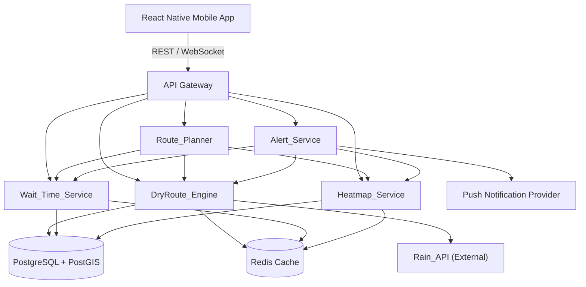

# Design Document: UW Flow

## Overview

UW Flow is a mobile application for University of Washington students that combines rain-aware navigation, live venue wait times, crowd-sourced check-ins, real-time campus heatmaps, and personalized push alerts into a single experience. The system is designed around a set of backend microservices that feed a React Native mobile client, with real-time data flowing through a WebSocket layer and a REST API for request/response interactions.

The core design philosophy is **data freshness with graceful degradation**: every subsystem must handle upstream failures (Rain_API outages, stale check-in data, etc.) by falling back to cached data and surfacing staleness indicators to the user rather than failing silently or crashing.

---

## Architecture

The system is composed of a mobile client, an API gateway, and five backend services. External data comes from the Rain_API weather provider and crowd-sourced check-ins from users.



**Key architectural decisions:**

- **PostGIS** is used for all geospatial queries (route segments, covered path polygons, construction zones, heatmap cells). This avoids reimplementing spatial indexing in application code.
- **Redis** is used for caching rain forecast data, heatmap snapshots, and wait time aggregates. TTLs enforce freshness requirements from the requirements doc.
- **WebSocket connections** push heatmap updates and alert notifications to connected clients in real time, avoiding polling.
- **API Gateway** handles auth (UW NetID OAuth), rate limiting, and routes requests to the appropriate service.

---

## Components and Interfaces

### DryRoute_Engine

Responsible for computing rain-aware routes that maximize covered path coverage.

```
GET /routes/dry
  params: origin (lat/lng), destination (lat/lng)
  returns: RouteOption[]  (sorted by coverage_score desc)

GET /routes/dry/coverage-score
  params: route_id
  returns: { coverage_score: number, staleness_warning: boolean }
```

Internally, the engine runs a modified Dijkstra's algorithm over the campus path graph where edge weights are adjusted by coverage type and current rain probability. When Rain_API is unavailable, it uses the last cached forecast and sets `staleness_warning: true` on the response.

### Wait_Time_Service

Aggregates check-in data and historical patterns to produce current and predicted wait times.

```
GET /venues
  returns: Venue[]

GET /venues/:id/wait-time
  returns: { current_minutes: number, predictions: WaitPrediction[], unverified: boolean, checkin_count: number }

POST /venues/:id/checkins
  body: { reported_wait_minutes: number, crowd_level: CrowdLevel }
  returns: { accepted: boolean }
```

Check-ins are ingested into a rolling time-window aggregator. Predictions at +10, +20, +30 minutes are produced by a lightweight time-series model seeded with historical data per venue per day-of-week and time-of-day. If no check-in has been received within 30 minutes, `unverified: true` is set.

### Route_Planner

Computes multi-factor optimal routes combining rain, crowds, elevation, construction, and time constraints.

```
GET /routes/smart
  params: origin, destination, class_start_time (ISO8601)
  returns: SmartRoute[]

WebSocket: /ws/routes/live
  subscribes to real-time route updates as conditions change
```

The planner composes inputs from DryRoute_Engine (coverage), Heatmap_Service (crowd density), a static elevation dataset, and a construction zone registry. It scores candidate routes and returns them ranked. If travel time exceeds time-to-class, it flags `late_warning: true` and promotes the fastest route to the top.

### Heatmap_Service

Tracks and surfaces crowd density across campus.

```
GET /heatmap
  returns: HeatmapSnapshot (grid of cells with density levels)

GET /heatmap/area/:cell_id
  returns: { label: "Quiet" | "Moderate" | "Busy", density_score: number }

GET /heatmap/quiet-spots
  returns: StudySpot[] (top 3 least-crowded study locations)

WebSocket: /ws/heatmap
  pushes HeatmapSnapshot updates every ≤2 minutes
```

Density is computed from check-in data, device location signals (anonymized, opt-in), and historical patterns. The heatmap grid uses PostGIS cells aligned to campus geography.

### Alert_Service

Generates and delivers personalized push notifications based on user preferences and live conditions.

```
POST /alerts/preferences
  body: UserAlertPreferences
  returns: { saved: boolean }

GET /alerts/preferences
  returns: UserAlertPreferences
```

The service runs a background evaluation loop per user. It checks:
1. Wait time thresholds against current venue data
2. Rain proximity alerts from DryRoute_Engine
3. Favorite study spot crowd changes from Heatmap_Service

It enforces a hard cap of 10 notifications/hour/user and respects per-type opt-out settings before dispatching to the push provider.

---

## Data Models

### RouteSegment

```typescript
interface RouteSegment {
  segment_id: string;
  start_point: GeoPoint;
  end_point: GeoPoint;
  distance_meters: number;
  is_covered: boolean;           // true if overhead protection exists
  coverage_type: "walkway" | "building_interior" | "tunnel" | "overhang" | "open";
  elevation_change_meters: number;
  has_construction: boolean;
}
```

### RouteOption

```typescript
interface RouteOption {
  route_id: string;
  segments: RouteSegment[];
  total_distance_meters: number;
  estimated_time_minutes: number;
  coverage_score: number;        // 0–100, % of route that is covered
  staleness_warning: boolean;    // true if rain data is stale
}
```

### SmartRoute

```typescript
interface SmartRoute extends RouteOption {
  crowd_score: number;           // 0–100, lower is less crowded
  indoor_shortcuts: IndoorShortcut[];
  late_warning: boolean;
  fastest: boolean;
}

interface IndoorShortcut {
  building_name: string;
  time_saved_minutes: number;
}
```

### Venue

```typescript
interface Venue {
  venue_id: string;
  name: string;
  location: GeoPoint;
  category: "dining" | "library" | "gym" | "advising" | "health" | "retail" | "transit";
}
```

### WaitPrediction

```typescript
interface WaitPrediction {
  minutes_from_now: 10 | 20 | 30;
  predicted_wait_minutes: number;
  recommendation: "Go Now" | "Go Later" | null;
  optimal_arrival_time?: string; // ISO8601, present when recommendation is "Go Later"
}
```

### CheckIn

```typescript
interface CheckIn {
  checkin_id: string;
  venue_id: string;
  user_id: string;              // anonymized hash
  reported_wait_minutes: number;
  crowd_level: "low" | "medium" | "high";
  submitted_at: string;         // ISO8601
  location_verified: boolean;
}
```

### HeatmapCell

```typescript
interface HeatmapCell {
  cell_id: string;
  polygon: GeoPolygon;
  density_score: number;        // 0–100
  label: "Quiet" | "Moderate" | "Busy";
  updated_at: string;           // ISO8601
}
```

### HeatmapSnapshot

```typescript
interface HeatmapSnapshot {
  cells: HeatmapCell[];
  generated_at: string;         // ISO8601
}
```

### UserAlertPreferences

```typescript
interface UserAlertPreferences {
  user_id: string;
  wait_time_alerts_enabled: boolean;
  wait_time_threshold_minutes: number;
  rain_alerts_enabled: boolean;
  quiet_spot_alerts_enabled: boolean;
  favorite_study_spots: string[]; // venue_ids
}
```

### RainForecast

```typescript
interface RainForecast {
  fetched_at: string;           // ISO8601
  valid_until: string;          // ISO8601
  is_stale: boolean;
  cells: RainCell[];
}

interface RainCell {
  location: GeoPoint;
  radius_meters: number;        // ≤500m resolution
  precipitation_probability: number; // 0–1
  minutes_until_rain: number | null; // null if no rain predicted
}
```

---

## Correctness Properties

*A property is a characteristic or behavior that should hold true across all valid executions of a system — essentially, a formal statement about what the system should do. Properties serve as the bridge between human-readable specifications and machine-verifiable correctness guarantees.*

**Property Reflection:** Before listing properties, redundancies were eliminated:
- 1.4 (default route has highest coverage) is subsumed by Property 1 (route maximizes coverage).
- 2.5 and 2.6 (Go Later / Go Now) are combined into a single recommendation logic property.
- 5.2 (rain alert) is subsumed by Property 3 (rain alert generation).
- 7.4 and 7.5 are subsumed by Property 6 (staleness fallback).
- 6.3 is the same as 2.3 (check-in latency) — covered as an integration example.
- 3.6 (travel time present) is subsumed by Property 10 (late warning logic).

---

### Property 1: Dry route maximizes coverage score

*For any* origin/destination pair, the first route returned by DryRoute_Engine should have a coverage_score greater than or equal to every other route returned for the same pair.

**Validates: Requirements 1.1, 1.4**

---

### Property 2: Coverage score is always a valid percentage

*For any* RouteOption returned by the system, its coverage_score must be a number in the range [0, 100] inclusive.

**Validates: Requirements 1.2**

---

### Property 3: Rain proximity triggers alert generation

*For any* user location and any RainForecast where at least one RainCell covering that location has minutes_until_rain ≤ 10, the Alert_Service should generate a rain alert for that user (provided rain alerts are enabled for that user).

**Validates: Requirements 1.3, 5.2**

---

### Property 4: Covered segment types map to is_covered = true

*For any* RouteSegment whose coverage_type is one of `walkway`, `building_interior`, `tunnel`, or `overhang`, the `is_covered` field must be `true`.

**Validates: Requirements 1.5**

---

### Property 5: Stale Rain_API produces staleness warning

*For any* route computation performed when the Rain_API is unavailable, the returned RouteOption(s) must have `staleness_warning = true` and must still contain valid route data (not an empty or error response).

**Validates: Requirements 1.6, 7.5**

---

### Property 6: Wait time predictions always include all three horizons

*For any* venue wait time response, the `predictions` array must contain exactly three entries with `minutes_from_now` values of 10, 20, and 30 respectively.

**Validates: Requirements 2.2**

---

### Property 7: Recommendation logic is consistent with prediction direction

*For any* venue wait time response where a prediction at any horizon has `predicted_wait_minutes < current_minutes`, the recommendation for that prediction must be `"Go Later"` with a non-null `optimal_arrival_time`. Conversely, where `predicted_wait_minutes > current_minutes`, the recommendation must be `"Go Now"`.

**Validates: Requirements 2.5, 2.6**

---

### Property 8: Unverified flag set after 30-minute check-in gap

*For any* venue whose most recent CheckIn has `submitted_at` more than 30 minutes before the current time, the wait time response must have `unverified = true`.

**Validates: Requirements 2.7**

---

### Property 9: No construction segments appear in planned routes

*For any* SmartRoute returned by Route_Planner, no RouteSegment in the route's `segments` array should have `has_construction = true`.

**Validates: Requirements 3.5**

---

### Property 10: Late warning set when travel time exceeds time-to-class

*For any* route request where `estimated_time_minutes > time_to_class_minutes`, the returned SmartRoute must have `late_warning = true` and must be the route with the minimum `estimated_time_minutes` among all returned routes.

**Validates: Requirements 3.3**

---

### Property 11: Indoor shortcuts always include building name and positive time saved

*For any* SmartRoute containing at least one IndoorShortcut, each shortcut must have a non-empty `building_name` and a `time_saved_minutes > 0`.

**Validates: Requirements 3.2**

---

### Property 12: Heatmap cells always have valid density labels

*For any* HeatmapCell in a HeatmapSnapshot, the `label` must be one of `"Quiet"`, `"Moderate"`, or `"Busy"`, and `density_score` must be in [0, 100].

**Validates: Requirements 4.1, 4.4**

---

### Property 13: Quiet spots are the three least-crowded study locations

*For any* HeatmapSnapshot, the study spots returned by the quiet-spots endpoint must be the three venues with the lowest `density_score` among all study-eligible locations in the snapshot.

**Validates: Requirements 4.5, 4.6**

---

### Property 14: Wait time threshold crossing triggers alert

*For any* user with `wait_time_alerts_enabled = true` and a configured `wait_time_threshold_minutes`, when a venue's `current_minutes` drops to or below that threshold, the Alert_Service must generate a wait time alert for that user.

**Validates: Requirements 5.1**

---

### Property 15: Favorite spot crowd drop triggers alert

*For any* user with `quiet_spot_alerts_enabled = true` and a favorited venue, when that venue's `density_score` drops significantly below its historical average, the Alert_Service must generate a quiet spot alert for that user.

**Validates: Requirements 5.3**

---

### Property 16: Alert preferences round-trip

*For any* valid UserAlertPreferences object, saving it via POST and then retrieving it via GET must return an equivalent object.

**Validates: Requirements 5.4**

---

### Property 17: Disabled alert types are suppressed

*For any* user who has disabled a specific alert type (e.g., `rain_alerts_enabled = false`), no alerts of that type should be generated for that user regardless of triggering conditions.

**Validates: Requirements 5.5**

---

### Property 18: Notification rate cap enforced

*For any* user and any sequence of triggering events, the number of push notifications dispatched to that user within any 60-minute sliding window must not exceed 10.

**Validates: Requirements 5.6**

---

### Property 19: Check-in data is persisted completely

*For any* CheckIn submitted via POST, retrieving that check-in must return the same `venue_id`, `reported_wait_minutes`, `crowd_level`, and `submitted_at` values that were submitted.

**Validates: Requirements 6.1**

---

### Property 20: Check-in count reflects recent submissions

*For any* venue, the `checkin_count` in the wait time response must equal the number of CheckIns for that venue within the active aggregation window.

**Validates: Requirements 6.4**

---

### Property 21: Stale location triggers confirmation prompt

*For any* CheckIn submission where the time elapsed since the user's last verified location at that venue exceeds 45 minutes, `location_verified` must be `false` and the system must require confirmation before accepting the check-in.

**Validates: Requirements 6.5**

---

### Property 22: Rain forecast cells respect spatial resolution

*For any* RainForecast, every RainCell must have `radius_meters ≤ 500`.

**Validates: Requirements 7.1**

---

## Error Handling

### Rain_API Unavailability
- DryRoute_Engine catches HTTP errors and timeouts from Rain_API.
- Falls back to the most recent valid RainForecast stored in Redis (TTL: 10 minutes).
- Sets `staleness_warning: true` on all RouteOption responses.
- If no cached forecast exists (cold start), returns routes with `coverage_score` computed from static covered-path data only and `staleness_warning: true`.

### Stale Check-In Data
- Wait_Time_Service tracks `last_checkin_at` per venue.
- If `now - last_checkin_at > 30 minutes`, sets `unverified: true` on the response.
- Predictions continue to be served from the historical model but are labeled as unverified.

### Location Verification for Check-Ins
- If `now - last_verified_location_at > 45 minutes`, the check-in is held in a pending state.
- The client receives a `location_confirmation_required: true` flag and must re-confirm before the check-in is committed.

### Construction Zone Data
- Construction zones are stored in the database with `active_from` and `active_until` timestamps.
- Route_Planner queries only active construction zones at request time.
- If the construction zone registry is unavailable, Route_Planner logs a warning and proceeds without construction filtering (fail-open, not fail-closed, to avoid blocking navigation).

### Push Notification Failures
- Alert_Service uses at-least-once delivery with idempotency keys to avoid duplicate notifications.
- Failed push deliveries are retried up to 3 times with exponential backoff.
- Notification rate cap is enforced before dispatch, not after, so retries do not count against the cap.

### WebSocket Disconnections
- Clients that disconnect from `/ws/heatmap` or `/ws/routes/live` will receive a full snapshot on reconnect.
- The server maintains a last-sent sequence number per connection to detect gaps.

---

## Testing Strategy

### Dual Testing Approach

Both unit tests and property-based tests are required. They are complementary:
- **Unit tests** cover specific examples, integration points, and error conditions.
- **Property-based tests** verify universal correctness across randomized inputs.

### Property-Based Testing

**Library**: [fast-check](https://github.com/dubzzz/fast-check) (TypeScript/JavaScript)

Each correctness property from the design document must be implemented as a single property-based test using fast-check. Tests must be configured to run a minimum of **100 iterations** per property.

Each test must include a comment tag in the following format:
```
// Feature: uw-flow, Property N: <property_text>
```

Example:
```typescript
// Feature: uw-flow, Property 1: Dry route maximizes coverage score
test("dry route always has highest coverage score", () => {
  fc.assert(
    fc.property(
      fc.record({ lat: fc.float(), lng: fc.float() }), // origin
      fc.record({ lat: fc.float(), lng: fc.float() }), // destination
      (origin, destination) => {
        const routes = dryRouteEngine.compute(origin, destination);
        const defaultRoute = routes[0];
        return routes.every(r => defaultRoute.coverage_score >= r.coverage_score);
      }
    ),
    { numRuns: 100 }
  );
});
```

### Unit Testing

Unit tests should focus on:
- **Specific venue examples**: verify all 11 supported venues return wait times (Requirement 2.4)
- **Check-in latency**: submit a check-in and verify it appears in the wait time within 60 seconds (Requirements 2.3, 6.3)
- **Alert delivery integration**: verify end-to-end alert dispatch for each alert type
- **Rain_API cold-start**: verify behavior when no cached forecast exists at all
- **WebSocket reconnect**: verify full snapshot is sent on reconnect

### Test Coverage Targets

| Component | Unit Tests | Property Tests |
|---|---|---|
| DryRoute_Engine | Rain_API fallback, cold start | Properties 1, 2, 4, 5 |
| Wait_Time_Service | All 11 venues, check-in latency | Properties 6, 7, 8, 20 |
| Route_Planner | Indoor shortcut display, late warning | Properties 9, 10, 11 |
| Heatmap_Service | Refresh cycle, WebSocket reconnect | Properties 12, 13 |
| Alert_Service | End-to-end dispatch, retry logic | Properties 3, 14, 15, 16, 17, 18 |
| CheckIn flow | Location confirmation prompt | Properties 19, 21 |
| RainForecast model | — | Property 22 |
